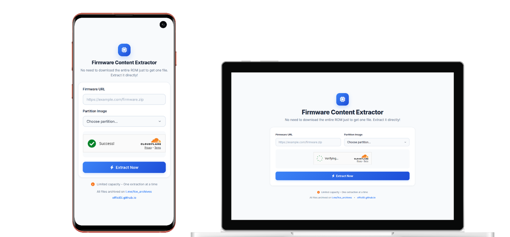

  <h2>Firmware Content Extractor</h2>
  

    Extract specific firmware partition images directly from a URL without downloading the entire ROM.
     
    <a href="https://fce-tool.pages.dev"><strong>Go to FCE »</strong></a>
  

  

## About FCE

**FCE** is a tool to simplify the process of obtaining specific files from firmware packages. Instead of downloading a large ROM file (often several gigabytes), you can simply provide a direct download link and select the partition image you need. That file will then be extracted and a direct link provided for downloading it. This saves time and bandwidth.

